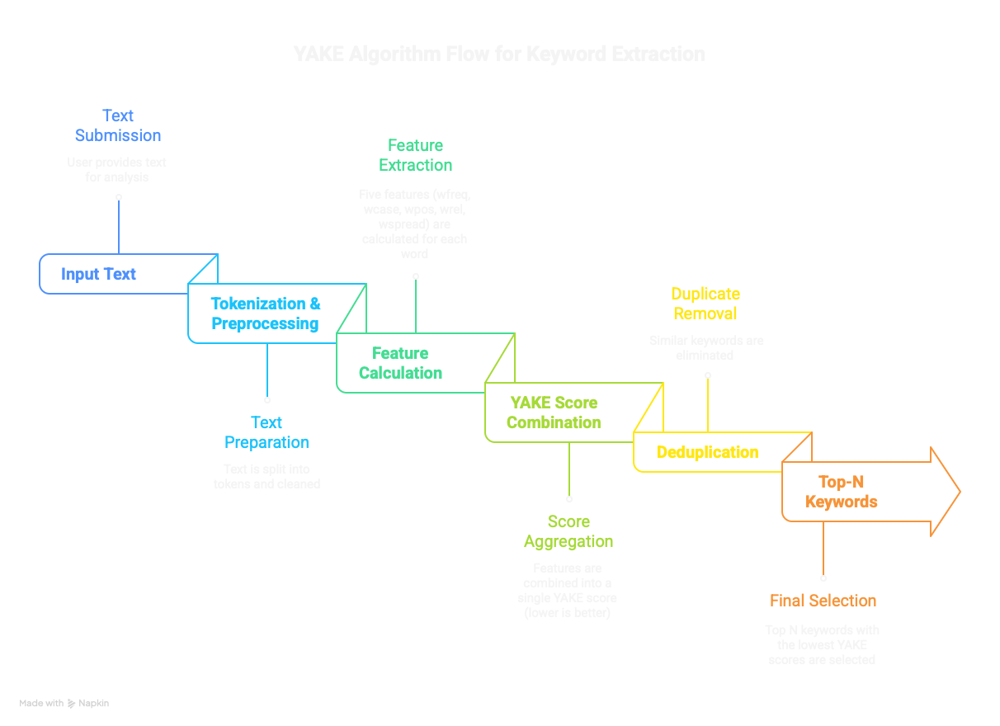

# Intelligent Text Tagger

An adaptive keyword extraction system that learns from user feedback to improve document tagging over time. Built around a custom implementation of the YAKE algorithm with machine learning enhancement.

## What It Does

This system extracts meaningful keywords from text documents and gets smarter as you provide feedback. Initially, it uses YAKE (Yet Another Keyword Extractor) to identify important terms. As you approve or reject suggestions, a Random Forest classifier learns your preferences and re-ranks future keywords accordingly.

The final scoring blends YAKE's statistical analysis with learned patterns from your feedback:
```
final_score = alpha * yake_score + (1-alpha) * ml_probability
```


## Quick Start

## Demo Video

Watch the demo: 


[![View Demo Video]](https://github.com/user-attachments/assets/0f0497db-6b9e-425c-82a9-f82427aad7d0)


### Installation

```bash
poetry install
```

### Basic Usage

**Extract keywords from a document:**
```bash
poetry run python main.py extract -i documents/test_cli.txt
```

**Extract with interactive feedback:**
```bash
poetry run python main.py extract -i documents/test_cli.txt --feedback
```

**Train the ML model from collected feedback:**
```bash
poetry run python main.py train
```

**View system statistics:**
```bash
poetry run python main.py stats
```

**Launch the web interface:**
```bash
poetry run streamlit run app.py
```

## How It Works

### YAKE Algorithm

YAKE scores keywords using five statistical features:

- **F1 (wfreq)**: Term frequency normalized by max frequency
- **F2 (wcase)**: Ratio of uppercase to total occurrences
- **F3 (wpos)**: Mean position of first occurrence
- **F4 (wrel)**: Context relatedness (co-occurrence with neighbors)
- **F5 (wspread)**: Distribution across sentences

Lower YAKE scores indicate better keywords. Multi-word phrases aggregate features from constituent terms.



### Feedback Loop

1. You review extracted keywords and mark them as accepted or rejected
2. Each decision is stored with full feature vectors (F1-F5 + metadata)
3. Once you have 10+ feedback samples, train a Random Forest model
4. The model learns which feature combinations predict good keywords
5. Future extractions blend YAKE scores with model predictions

## How Feedback Improves the System

**Learns Your Vocabulary**
- Recognizes domain-specific keywords and stops suggesting irrelevant generic terms
- Adapts to your preferred style (single words vs. phrases, granularity)

**Corrects YAKE's Weaknesses**
- Adds human judgment to statistical extraction
- Fixes false positives unique to your documents

**Improves Over Time**
- First document: ~60-70% accuracy → After 10 documents: ~85-90%
- Feedback from one document benefits all future extractions

### RAG Enhancement (Bonus)

The `rag/` folder demonstrates how YAKE keywords can improve retrieval-augmented generation. Keywords extracted from documents are stored as metadata in ChromaDB. When querying, keyword overlap between the query and documents helps surface more relevant results.


Run the Jupyter notebook to see it in action:
```bash
jupyter notebook rag/demo.ipynb
```

## Project Structure

```
.
├── main.py                 # CLI interface
├── app.py                  # Streamlit web UI
├── feedback_manager.py     # Feedback storage and retrieval
├── yake/                   # YAKE implementation
│   ├── extractor.py        # Main keyword extractor
│   ├── scorer.py           # Feature calculation
│   ├── feature_extractor.py # Individual feature extractors
│   └── utils.py            # Helper functions
├── ml/                     # Machine learning components
│   ├── train.py            # Model training
│   ├── predict.py          # Prediction and re-ranking
│   └── config.py           # ML configuration
├── tests/                  # Unit tests
├── rag/                    # RAG demonstration
│   ├── demo.ipynb          # Interactive notebook
│   └── demo_documents/     # Sample documents
└── data/                   # Feedback storage (created on first use)
```

## CLI Commands

**extract** - Extract keywords from a text file
```bash
poetry run python main.py extract -i <file> [--top N] [--ngrams N] [--dedup THRESHOLD] [--feedback]
```

**train** - Train ML model from collected feedback
```bash
poetry run python main.py train
```

**stats** - Show system statistics
```bash
poetry run python main.py stats
```

## Testing

Run the full test suite:
```bash
poetry run pytest tests/ -v
```

Tests cover:
- YAKE feature extraction and scoring
- Feedback storage and retrieval
- ML model training and prediction
- End-to-end keyword extraction

## Design Decisions

**Why YAKE?** It's unsupervised (no training data needed), language-agnostic, and provides interpretable features that work well as ML inputs.

**Why Random Forest?** It handles the mix of normalized scores and discrete features (like keyword size) effectively, and feature importance helps explain what makes a good keyword.

**Why hybrid scoring?** Pure YAKE is deterministic but doesn't adapt. Pure ML needs lots of data. Blending both gives you reasonable defaults that improve with feedback.

**Why CSV for feedback?** Simple, portable, human-readable, and easy to inspect or migrate. For production scale, switch to SQLite or a proper database.

## Future Extensions

- **LLM Integration**: Use GPT-4 to refine keywords or generate semantic variations
- **Vector Search**: Embed keywords and documents for similarity-based retrieval
- **Multi-language**: Extend stopword lists and feature extractors beyond English
- **Active Learning**: Intelligently select which keywords to request feedback on
- **Batch Processing**: Process entire document folders with parallel extraction

## Requirements

- Python ≥3.11
- Dependencies managed via Poetry (see `pyproject.toml`)

